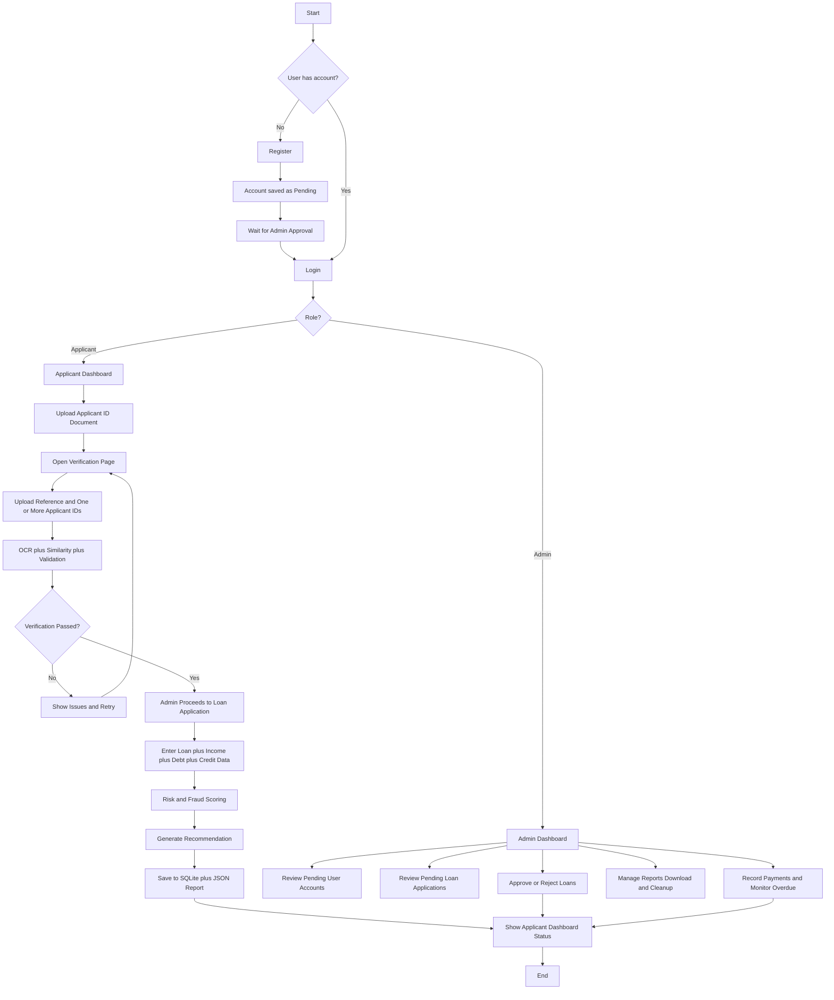
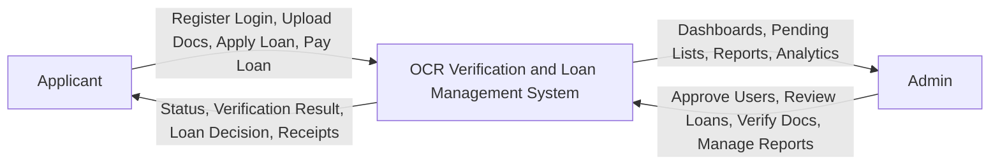
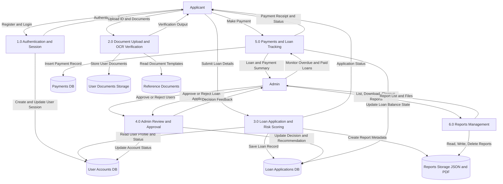

# OCRverification System Diagrams

This file contains implementation-ready Mermaid diagrams for system flow and data flow.

## 1) System Flowchart

## 2) DFD Level 0 (Context)

## 3) DFD Level 1

## Optional next diagram

You can add a DFD Level 2 focused on Loan Processing as a separate section if needed for thesis documentation.
